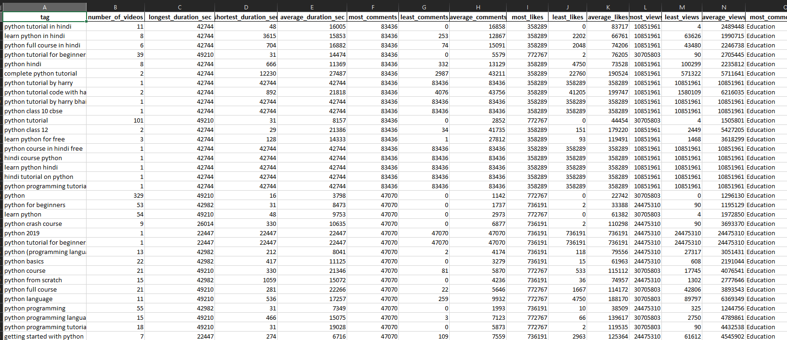

# Youtube Video Tags Analysis ETL

# Problem

Starting a Youtube Channel!

Before starting a youtube channel about a specific topic on youtube, we have to research about the topic, understand the reach and available videos for it, and get analytics about it.

I have implemented a ETL pipeline that extracts data from the Youtube API, transforms the data so its fit for storage, stores it and get analysis reports according to our needs

Below is one of the sheets of the analysis report!

# Setup

The code runs on Jupyter notebook so that each cell and each part can be clearly labeled as I was going through making this code myself.

There is a requirements.txt file that includes all the libraries necessary for running the notebook

# Code

The code is divided into 4 parts.

## Step 1: Get all data on keywords specified from the API

This part of the code calls the API and gets the data for the keyword we want to search. It gets all the videos it can find in the search list and saves the video Id if it is present.

Afterward, the API calls are made by each video Id to get statistical information about each video, this data is received in JSON format and is then cleaned and stored in a database.

## Step 2: Clean & Store the data in a DB

The Database is fairly simple and contains 3 tables

1. Category

   This table contains a hash-map like structure for all category data

2. Video

   This table contains all the relevant information for each video. VideoId is the primary key here.

3. Tag

   This table contains unique tuples, this is the structure for storing the unique tuples of videId & tag_name, as they had a many-to-many relationship

## Step 3: Analysis

This part of the code can run without running Step 1 & Step 2 again as the DB has already been made and attached in the zip. This part reads from the DB, uses joins to get the data in the shape we want and then some operations are performed which get us the analysis on Tags & Categories. The output of this can be shown directly to the user and he can get a clear idea about the tag & category information about the keyword that was searched.

## Step 4: Classification of Tags to Categories

This part of the code does some basic EDA (Exploratory Data Analysis) on the data, performs feature engineering, and uses a random forest of 100 trees to classify data.

70% data is used for Training and 30% data is used for Testing here. The model gives an astonishing accuracy of 96.63%, but that is mainly because one class has a lot of entries in the data as compared to others

In the end, we have the feature importance of each column and that concludes the notebook.
